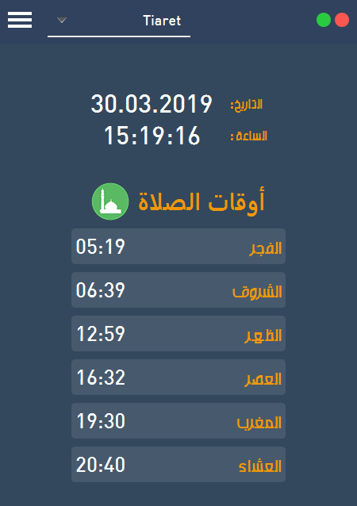
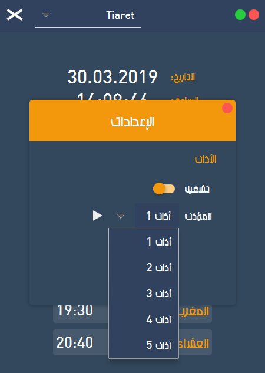
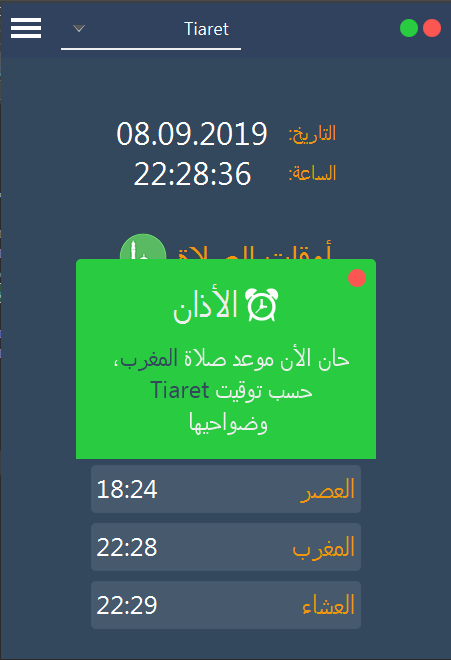

# Prayer Times  أوقات الصلاة
[](https://github.com/just-some-tall-bloke/prayer-times/blob/HEAD/LICENSE)

Desktop app for calculating Muslim prayer times 🕌 and setting an alarm (Adhan) :alarm_clock: for the prayer times. <br />
أداة تساعدك على معرفة أوقات الصلاة في الجزائر وعدة دول أخرى وتقوم كذلك بتشغيل الأذان عندما يحين موعد الصلاة

## Features
* [x] Simple to use
* [x] All Algeria cities + major cities of Indonesia, Turkey, Pakistan, Egypt, Saudi Arabia, Morocco and Malaysia
* [x] Interface languages: العربية / English (English by default), with localized city names
* [x] Selectable prayer calculation method (defaults to Umm Al-Qura, Makkah)
* [x] Preview the selected adhan sound from the settings
* [x] Remembers your settings (city, country, adhan, language, method, etc.)
* [x] Shows a tap-to-retry hint when prayer times can't be loaded
* [x] Can hide the app in the system tray

## Screenshots
Main screen           | Settings Page
:---------------------:|:------------------:
 | 
Adhan (Alarm)           |
 |

## Requirements
* Java 21+
* Maven

## Installation
1. Download the repository (project) from the download section or clone it using the following command:
   ```shell
   git clone https://github.com/just-some-tall-bloke/prayer-times.git
   ```
2. Run the app by running the maven command inside the project folder:
   ```shell
   mvn clean javafx:run
   ```

## Contributing 💡
If you want to contribute to this project and make it better with new ideas, your pull request is very welcomed.
If you find any issue just put it in the repository issue section, thank you.
